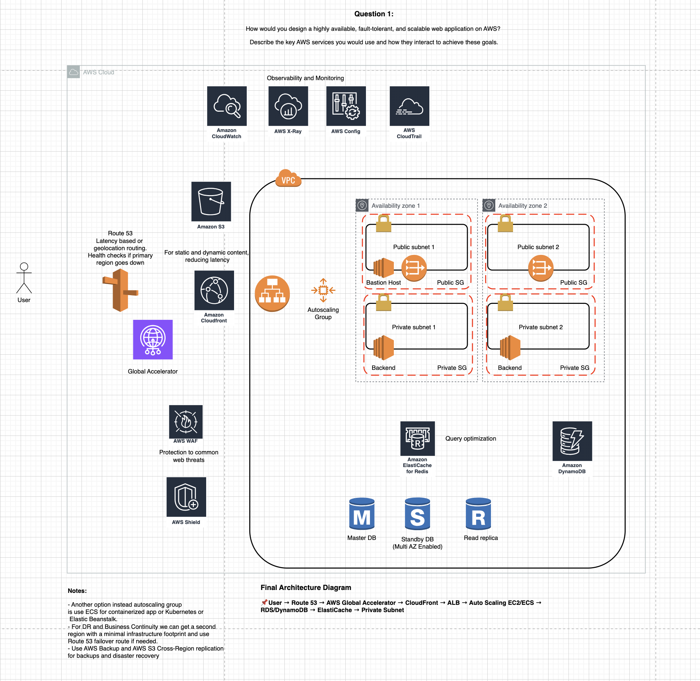

# 🧠 AWS Design Questions & Answers (Visual Format)

Welcome to the **AWS Design Questions & Answers** repository!
This repo is designed as a personal knowledge base focused on **cloud architecture**, using **images** to answer common and advanced AWS-related design questions.

## 📁 Structure
Each image represents a visual answer to a specific design question.

## 🔥 Questions
###Question 1

*Tags: `vpc`, `route53`, `Global Accelerator`, `Cloudfront`, `S3`, `RDS`, `DynamoDB`,`Redis`, `Shield`, `WAF` `X-Ray`, `Config`, `Cloudtrail`, `Cloudwatch`*

## 🚀 Contribution (optional)

Want to contribute or suggest a new visual question?
Open an issue or submit a PR with your image under the appropriate question.

## 📌 License

This project is for educational purposes. Please do not reuse visuals without proper attribution unless they’re originally created by you.

---
Created with ❤️ by a fellow AWS enthusiast.